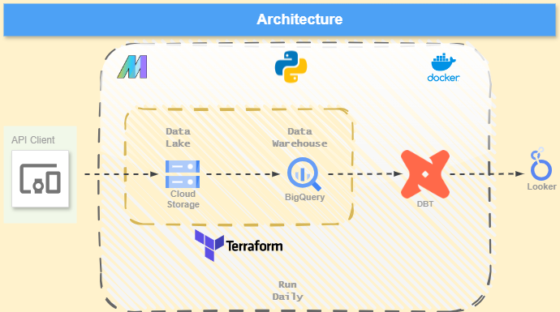
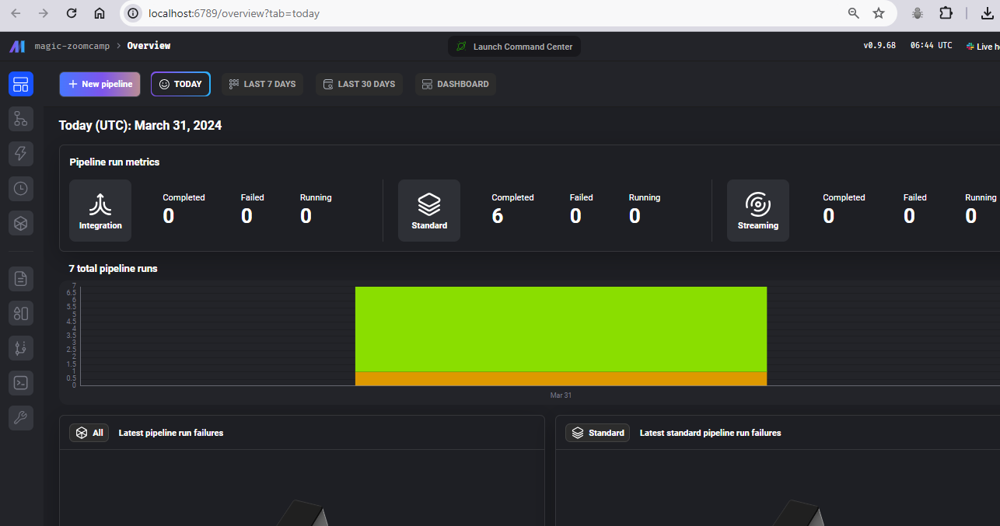
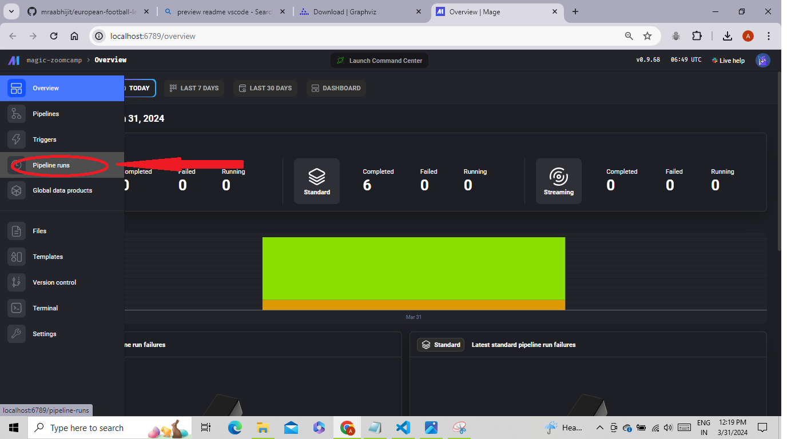
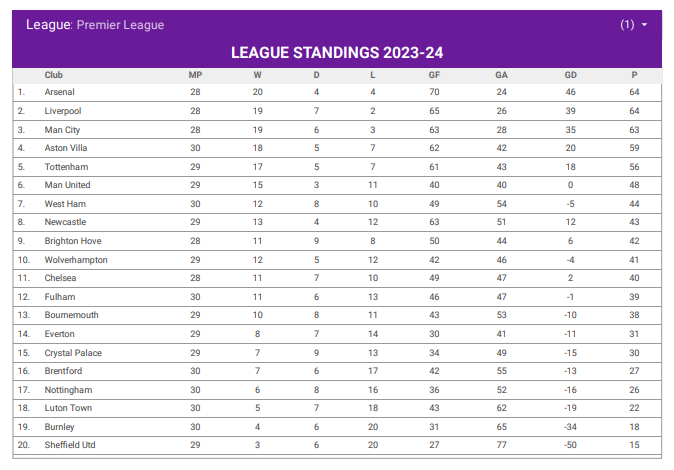
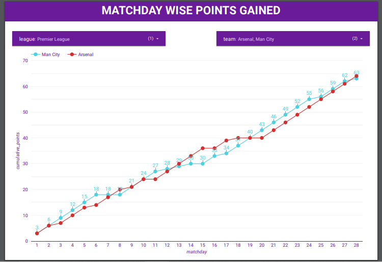

# European Football Leagues

## [Content](#content)

- [Problem Description](#problem-description)
- [Strategy](#strategy)
- [Prerequisities](#prerequisities)
- [Steps to Follow](#steps-to-follow)
- [Dashboard](#dashboard)
- [Next Steps](#next-steps)
- [Contributors](#contributors)
- [Acknowledgements](#acknowledgements)
- [Feedback](#feedback)

## [Problem Description](#problem-description)

This project aims at analysing the top 5 European Football Leagues namely, 
- Premier League (England)
- Bundesliga (Germany)
- La Liga (Spain)
- Serie A (Italy) 
- Ligue 1 (France)

To do the same, data is captured from https://www.football-data.org/ as .json files using their API endpoint.
The free tier has a restriction of 10 API requests/minute, which is the primary reason for the pipelines taking longer to run.

## [Strategy](#strategy)

The strategy used is Batch Processing for this project on daily frequency and developed in `Mage` which is used as `workflow orchestrator`.
Furthermore, `terraform` as `Infrastructure as code (IaC)` has been used to create resources in `GCP` which is the cloud service for the project for ease of allocation and removal.

The data source being https://www.football-data.org/. 
Data is first ingested via API endpoints, which is then dumped to a `data lake` in `Google Cloud Storage Buckets` as `parquet` files.

Once the data is stored there, data is further cleaned for processing using simple python scripts, and segragated into usable tables
which are stored to a `data warehouse` in `BigQuery`.

Next, the tables are read to `DBT` for `batch processing` and further transformed into the end result for visualizations. The `matchday_wise_tally` table is 
partitioned on the `leagues` feature as the data is essentially from different leagues.

Finally the tables are visualized in `Looker Studio`. Link to which is provided in a later section.



## [Prerequisities](#prerequisities)

    - docker
    - docker-compose
    - terraform
    - git
    - any IDE
    - GCP account
    - gcloud (if not working on a GCP VM)

## [Steps to Follow](#steps-to-follow)

### 1. Git clone the repo: 

Run the following command to clone the repo:

`git clone https://github.com/mraabhijit/european-football-leagues.git`

And install `python-dotenv` if not installed:

`pip install -r requirements.txt`

### 2. Create your cloud infrastructure using terraform:

`cd terraform`

Change the following variables as per your setup/keep the existing ones:

- in variables.tf, the default values of
    - variable "project"
    - variable "region"
    - variable "location"
    - variable "bq_dataset_name"
    - variable "gcs_bucket_name"
- in main.tf, 
    - rename "capstone-411615" to default used for "gcs_bucket_name"
    - rename "capstone" to default used for "bq_dataset_name"

Once the names are setup follow the following commands:

```
terraform init
terraform plan
terraform apply
```
**NOTE: terraform plan is to see what changes/resources are getting created. This step is optional but recommended.**

**NOTE: If your resources already exist, you will be notified stating the resources already exist.**

Once the commands are run, go to your GCP Console and check whether the GCS bucket and BQ dataset have been created.

### 3. Create the .env file by 

```
cd ..
cd mage
cp dev.env .env
```

This will create a new file called .env and will have the variables needed for the project to run set up. Change the credentials under `GCP` and `Football-org` as they are user specific. 

**NOTE: Make sure to use the same credentials as set up in `terraform/variables.tf`.**

### 4. Create account in https://www.football-data.org/
   
Upon creating the account, you will receive an email with the API Key for the account. Save it to the .env file created in previous step under `X_AUTH_TOKEN` without quotes in directory `mage/.env`.

If your API key is `123qwert`, your `.env` file should look like this:

`X_AUTH_TOKEN=123qwert`

**NOTE: If you are using a paid version of the API, your wait times will be lower than the free version, hence in file `mage/magic-zoomcamp/data_loaders/ingest_football_org_data.py` change the lines 48, 49 accordingly. If you are on a free version, the max number of hits per minute is 10 hence the data load takes the bulk of time.**

### 5. GCP service account key: 

Save your gcp service account key to 2 folders as

- `/mage/magic-zoomcamp/.secret/capstone.json`
- `/.secret/capstone.json`

### 6. Run Pipeline:

Now, you are ready to trigger the pipeline to ingest, transform, load data to biquery.
Change your current directory to mage in terminal if not there and run the following command

`docker-compose up`

This will for the first time pull the mageai docker image and fire up the mage environment. Wait for a few moments and when you can see the following message:

`magic-1  | INFO:mage_ai.orchestration.pipeline_scheduler_original:Active pipeline runs: []`

Open up your browser and go to http://localhost:6789/overview mage dashboard similar to below, open up a new terminal.



In your new terminal under mage directory, run the following to trigger the pipeline to start and relax. The entire pipeline shall run for about 20-25 mins due to the API hit request limits of 10/minute.

`python trigger.py`

Now go to the mage dashboard, on the left side as below to see the running pipelines. You can also check the logs for further information.



Once the pipeline completes, go to your GCP Bucket, there should ne 2 files called `matches.parquet` and `teams.parquet`.
And in your Bigquery dataset, the following tables should be present:

    1. stg_matches.sql
    2. stg_matches_info.sql
    3. stg_teams.sql
    4. away_table.sql
    5. home_table.sql
    6. overall_table.sql
    7. matchday_wise_tally.sql

### 7. Visualization:

Vizualizations for the dataset have been created using Looker Studio in attempts to create the football league tables of top 5 leagues in Europe.

The link to dashboard can be found in this link: https://lookerstudio.google.com/reporting/3a0f0cd3-edec-49b2-96a7-c3192f5c91db/page/hAxuD

### 8. Remove Resources:

Once the project is complete. Please remember to close mage first by running `docker-compose down` in a new terminal on your PC/VM by changing directory to `mage`. Lastly, close down the GCP resources by a simple `terraform destroy` from `terraform` directory.

## [Dashboard](#dashboard)

Link to the PDF version of the dashbaord is here: https://github.com/mraabhijit/european-football-leagues/blob/main/dashboard/EUROPEAN_FOOTBALL.pdf

Some of them being:





## [Next Steps](#next-steps)

- Add tests
- Use make
- Add CI/CD pipeline

## [Contributors](#contributors)

- Abhijit Chakraborty 
- Socials: [Linkedin](https://www.linkedin.com/in/mraabhijit) | [X](https://twitter.com/mraabhijit) | [Outlook](ab.chakraborty@outlook.com) | [Gmail](abhichaxz@gmail.com)


## [Acknowledgements](#acknowledgements)

- [Daniel from Football-data](daniel@football-data.org)
- [Alexey Grigorev](https://www.linkedin.com/in/agrigorev/)
- [DataTalks.Club](https://datatalks.club/slack.html)
- [Victoria Perez Mola](https://www.linkedin.com/in/victoriaperezmola/)
- [Ankush Khanna](https://www.linkedin.com/in/ankushkhanna2/)
- [Matt Palmer](https://www.linkedin.com/in/matt-palmer/)
- [Luis Oliveira](https://www.linkedin.com/in/lgsoliveira/)
- [Michael Shoemaker](https://www.linkedin.com/in/michaelshoemaker1/)
- [Mage Slack Community](https://app.slack.com/client/T03GK6PEQP6/C03GGQTS8CT)

And numerous others within the DataTalks.Club's DE-Zoomcamp-2024 Community for your support.

## [Feedback](#feedback)

Any feedback received will be highly appreciated. All sorts of contributions and ideas are welcome to add on to the current project and improve the models. 
